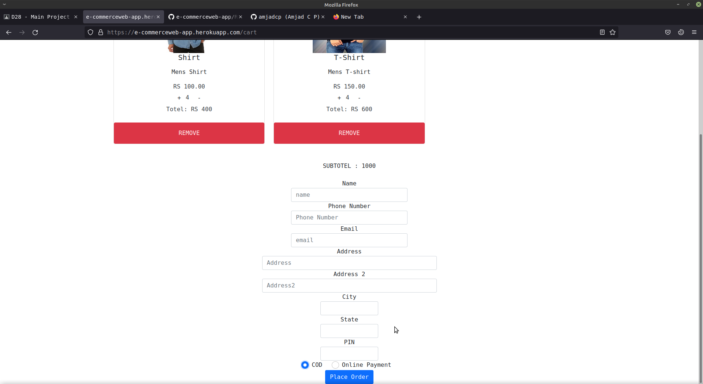

<!-- PROJECT HEAD -->
<br />

  <h1 align="center">E-commerce</h1>

  <p align="center">
  'E-commerce' is a sample online shoping site, it created for just learning about 'Django' the python framework.
    <br />
    <a href="https://e-commerceweb-app.herokuapp.com/"><strong>Explore the site »</strong></a>
    <br />
    <br />
    <a href="https://github.com/amjadcp/e-commerceweb-app/issues">Report Bug</a>
    ·
    <a href="https://github.com/amjadcp/e-commerceweb-app/issues">Request Feature</a>
  </p>
</p>

 <br>
 <br>
 <br>
 <br>
 <br>


<!-- TABLE OF CONTENTS -->
<details open="open">
  <summary>Table of Contents</summary>
  <ol>
    <li>
      <a href="#about-the-project">About The Project</a>
      <ul>
        <li><a href="#built-with">Built With</a></li>
      </ul>
    </li>
    <li>
      <a href="#getting-started">Getting Started</a>
      <ul>
        <li><a href="#prerequisites">Prerequisites</a></li>
        <li><a href="#installation">To use</a></li>
      </ul>
    </li>
    <li><a href="#roadmap">Roadmap</a></li>
    <li><a href="#contributing">Contributing</a></li>
    <li><a href="#license">License</a></li>
    <li><a href="#contact">Project Link</a></li>
    <li><a href="#contributers">Contributers</a></li>
    <li><a href="#Phase of program">Phase of program</a></li>
  </ol>
</details>


<!-- ABOUT THE PROJECT -->
## About The Project

'E-commerce' is a sample online shoping site, it created for just learning about 'Django' the python framework. In PyDjango boot camp conducted by Pygrammers community
Here's why:
* It is a sample online fasion shoping site
* Added basic features of online shoping site
* Front-end of site is not good(lazy for designing)
 

A list of commonly used resources that I find helpful are listed in the acknowledgements.

### Built With

* [HTML](https://html.spec.whatwg.org/)
* [CSS](https://www.w3schools.com/Css/)
* [JavaScript](JavaScript.com)
* [Bootstrap](https://getbootstrap.com/)
* [Django](https://www.djangoproject.com)
* [Postgresql](https://www.postgresql.org)
* [Heroku](https://www.heroku.com)
 


<!-- GETTING STARTED -->
## Getting Started

This is an example of how you may give instructions on setting up your project locally.
To get a local copy up and running follow these simple example steps.

### Prerequisites

This is an example of how to list things you need to use the software and how to install them.

### To use

1. Clone the repo
   ```sh
   git clone https://github.com/amjadcp/e-commerceweb-app
   ```
2. open folder in teminal

3. Clone the repo
   ```sh
   pip install -r requirement.txt
   ```
4. Clone the repo
   ```sh
   python manage.py runserver
   ```
<!-- ROADMAP -->
## Roadmap

See the [open issues](https://github.com/othneildrew/Best-README-Template/issues) for a list of proposed features (and known issues).


<!-- CONTRIBUTING -->
## Contributing

Contributions are what make the open source community such an amazing place to be learn, inspire, and create. Any contributions you make are **greatly appreciated**.

1. Fork the Project
2. Create your Feature Branch (`git checkout -b feature/AmazingFeature`)
3. Commit your Changes (`git commit -m 'Add some AmazingFeature'`)
4. Push to the Branch (`git push origin feature/AmazingFeature`)
5. Open a Pull Request


<!-- LICENSE -->
## License

Distributed under the MIT License. See `LICENSE` for more information.


<!-- project link -->
## Project Link

Project Link: [https://github.com/amjadcp/e-commerceweb-app](https://github.com/amjadcp/e-commerceweb-app)


<!-- CONTRIBUTERS -->
## Contributers
* [Amjad CP](https://github.com/amjadcp)

## Phase of program
1. Frontend creation
2. Implement with backend
3. Connect to Database
4. Deploy the web-app


